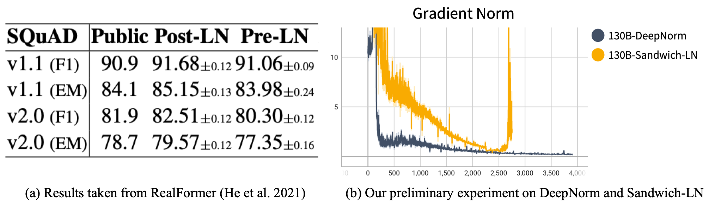
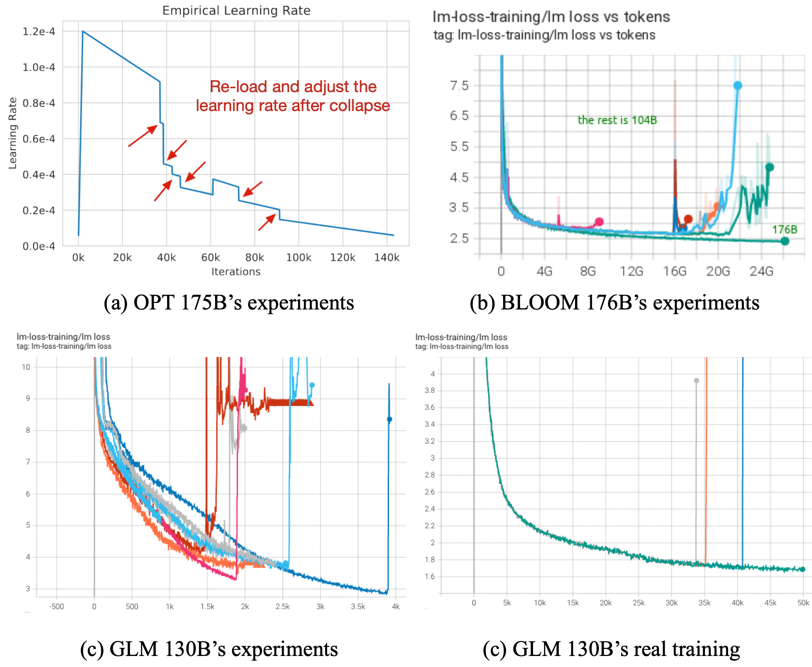
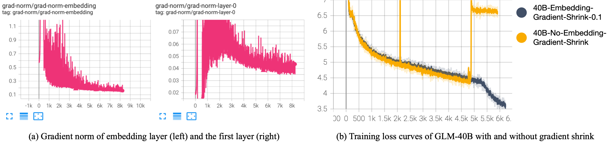
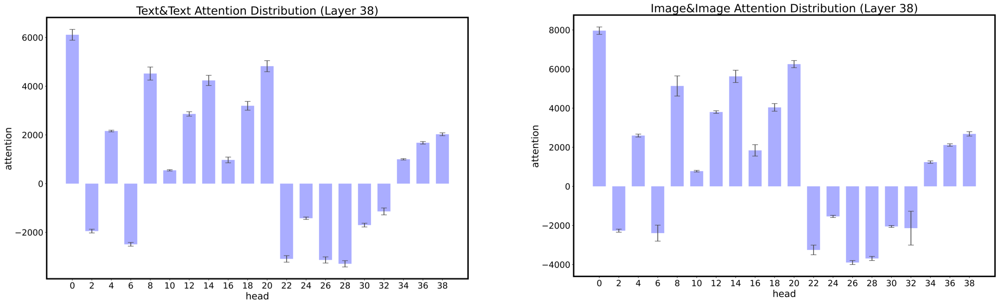
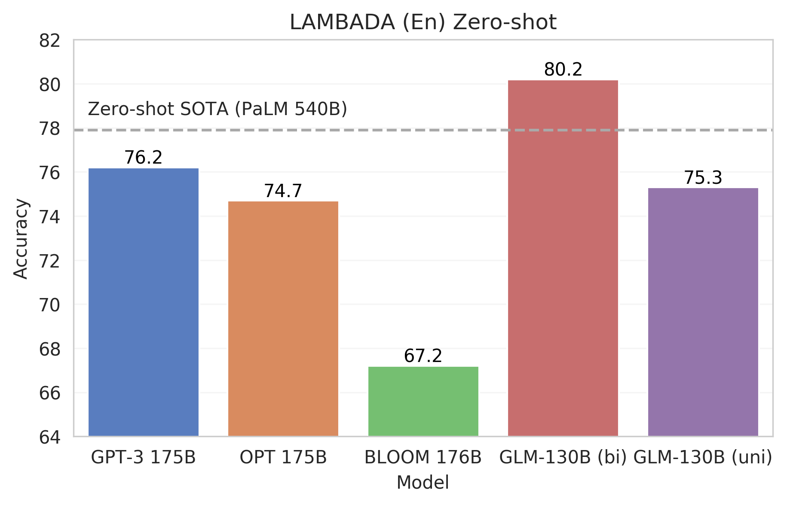
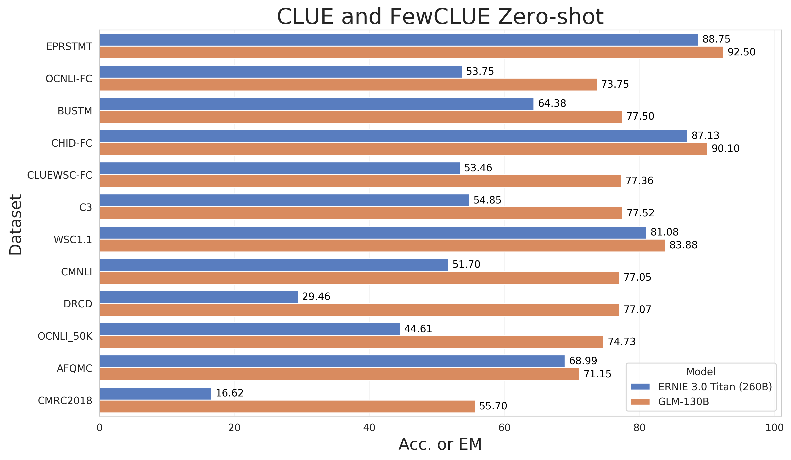

<p align="center">
   🌐 <a href="http://keg.cs.tsinghua.edu.cn/glm-130b/posts/glm-130b/" target="_blank">Blog</a> • ⏬ <a href="https://docs.google.com/forms/d/e/1FAIpQLSehr5Dh_i3TwACmFFi8QEgIVNYGmSPwV0GueIcsUev0NEfUug/viewform" target="_blank">Download Model</a> • 🪧 <a href="https://huggingface.co/spaces/hanyullai/GLM-130B" target="_blank">Demo</a> • ✉️ <a href="mailto:glm-130b@googlegroups.com">Email</a>
  • 📃 Paper (Coming soon) <br>
</p>

# GLM-130B: An Open Bilingual Pre-Trained Model

GLM-130B is an open bilingual (English & Chinese) bidirectional dense model with 130 billion parameters, pre-trained using the algorithm of [General Language Model (GLM)](https://aclanthology.org/2022.acl-long.26). It is designed to support inference tasks with the 130B parameters on **a single A100 (40G * 8)** or **V100 (32G * 8) server**. As of July 3rd, 2022, GLM-130B has been trained on over 400 billion text tokens (200B each for Chinese and English) and it has the following unique features:
 
- **Bilingual:** supports both English and Chinese. 
- **Performance (EN):** better than GPT-3 175B (+4.0%), OPT-175B (+5.5%), and BLOOM-176B (+13.0%) on LAMBADA and slightly better than GPT-3 175B (+0.9%) on MMLU.
- **Performance (CN):** significantly better than ERNIE TITAN 3.0 260B on 7 zero-shot CLUE datasets (+24.26%) and 5 zero-shot FewCLUE datasets (+12.75%). 
- **Fast Inference:** supports fast inference on both [SAT](https://github.com/THUDM/SwissArmyTransformer) and [FasterTransformer](https://github.com/NVIDIA/FasterTransformer) (up to 2.5X faster) with a single A100 server.
- **Reproducibility:** all results (30+ tasks) can be easily reproduced with open-sourced code and model checkpoints.
- **Cross-Platform:** supports training and inference on NVIDIA, Hygon DCU, Ascend 910, and Sunway (Will be released soon).

## Getting Started

### Environment Setup

The GLM-130B code is built on the top of [SAT](https://github.com/THUDM/SwissArmyTransformer). We recommend using [Miniconda](https://docs.conda.io/en/latest/miniconda.html) to manage your environment and installing additional dependencies via `pip install -r requirements.txt`. Here are the recommended environment configurations:

- Python 3.9+ / CUDA 11+ / PyTorch 1.10+ / DeepSpeed 0.6+ / Apex (**installation with CUDA and C++ extensions is required, see [here](https://github.com/NVIDIA/apex/#linux)**)
    
It is recommended to use the an A100 (40G * 8) server, as all GLM-130B evaluation results (~30 tasks) reported can be easily reproduced with a single A100 server in about half a day. GLM-130B can also be inferenced on servers with smaller GPU memory, such as a V100 (32G * 8) server. See [Low-Resource Inference](docs/low-resource-inference.md) for details.

Download the GLM-130B’s model checkpoint from [here](https://docs.google.com/forms/d/e/1FAIpQLSehr5Dh_i3TwACmFFi8QEgIVNYGmSPwV0GueIcsUev0NEfUug/viewform?usp=sf_link), make sure all 60 chunks are downloaded completely, then use the following command to merge them into a single archive file and extract it:

```bash
cat glm-130b-sat.tar.part_* > glm-130b-sat.tar
tar xvf glm-130b-sat.tar
```

Set `CHECKPOINT_PATH` in `configs/model_glm_130b.sh` to the path of the extracted folder. Since the checkpoint file is up to 260G, it is recommended to use the SSD or RAM disk to reduce the checkpoint loading time.

### Left-To-Right Generation / Blank Filling

```bash
bash scripts/generation.sh  --input-source interactive
```

You can also specify an input file by `--input-source input.txt`.

GLM-130B uses two different mask tokens: `[MASK]` for short blank filling and `[gMASK]` for left-to-right long text generation. When the input does not contain any MASK token, `[gMASK]` will be automatically appended to the end of the text.

<details>
<summary><b>Left-To-Right Generation Examples</b></summary>
    
#### Example 1
Input: Who is the greatest artist? The greatest artist is [gMASK]

Output: Who is the greatest artist? The greatest artist is not the one who paints the most beautiful picture, or writes the best poem, or plays the best symphony. The greatest artist is the one whose work has the greatest impact on the lives of others. The Greatest Artist is the artist who inspires us to be our best selves. The Great Artist is not the artist whose work is flawless. The great artist is not one who is perfect. The true great artist has the ability to make us feel something. The artist who makes us feel is the great artist. The art of the great artists is to make you feel something that you have never felt before. The greatness of an artist is in the ability of their work to touch the lives and hearts of others, and to make them feel something they have never experienced before. This is the true greatness of the artist. 2. The Significance of the Great Artist The significance of the greatest artist cannot be overstated. The significance and impact of the art of a great artist cannot even be measured. The impact of a single work of art can change the course of history. A single work can change a person’s life. A work of great art can make you laugh, make you cry, make your heart race, or make you think. A great work of artistic expression has the power to change the way you look at the world. The work of a truly great artist can change your life forever. 3. The Impact of the Greatest Artist The greatest artists have the ability and the power of their art to change people’s lives. They have the power and the ability, through their art, to make people feel something new. The power of the work of the truly great artists cannot be measured, but it can be felt. The greater the impact of an artists work, the greater the power it has to change lives. 4. The Influence of the Art of the Artist The art and the work created by the greatest artists has the potential to change a life. The influence of the artists work cannot be quantified, but is felt by those who experience it. The truly great work has an ability to touch people’ lives in a way that no other work can.
  
#### Example 2 (Chinese)
Input: 问题：冬天，中国哪座城市最适合避寒？问题描述：能推荐一些国内适合冬天避寒的城市吗？回答用户：旅游爱好者 回答： [gMASK]
  
Output: 问题:冬天,中国哪座城市最适合避寒?问题描述:能推荐一些国内适合冬天避寒的城市吗?回答用户:旅游爱好者 回答:避寒的话,建议去海南三亚。 三亚位于海南岛的最南端,是中国最南部的热带滨海旅游城市,中国海滨城市,是中国空气质量最好的城市、全国最长寿地区(平均寿命80岁)。三亚市别称鹿城,又被称为"东方夏威夷",位居中国四大一线旅游城市"三威杭厦"之首,拥有全岛最美丽的海滨风光。三亚拥有被无数城市嫉妒的清新空气,柔和海滩。在沙滩悠闲散步、沐浴傍晚温和阳光,在海边玩耍,在雨林里面呼吸健康,欣赏自然奇观,一切都是那么令人享受。 气候 三亚地处热带,属热带季风气候区域,终年气温高,寒暑变化不大,年平均气温25.5度。三亚最热的月份是6月,平均气温为28.5°C,极端最高气温为35.7°C ,三亚没有明显的冬季,而且冬季更是到海滨旅游的最好时候,所以三亚是全年全天候避寒、消暑、度假、旅游的好地方。不过,三亚最旺的旅游时间是从10月份到农历春节,这个时候的人特别多,房间也不好订,建议最好避开高峰。三亚的三个旅游高峰期是"五一"、"十一"、"春节",这三个节日期间的房价都会上浮几倍,如果你选择了这三个假期来三亚的话要提前一个星期定房和咨询。
</details>

<details>
<summary><b>Blank Filling Examples</b></summary>
  
#### Example 1
Input: Ng is an adjunct professor at [MASK] (formerly associate professor and Director of its Stanford AI Lab or SAIL ). Also a pioneer in online education, Ng co-founded Coursera and deeplearning.ai.
  
Output: Ng is an adjunct professor at Stanford University (formerly associate professor and Director of its Stanford AI Lab or SAIL ). Also a pioneer in online education, Ng co-founded Coursera and deeplearning.ai.<br/>

#### Example 2 (Chinese)
Input: 凯旋门位于意大利米兰市古城堡旁。1807年为纪念[MASK]而建，门高25米，顶上矗立两武士青铜古兵车铸像。
  
Output: 凯旋门位于意大利米兰市古城堡旁。1807年为纪念拿破仑胜利而建,门高25米,顶上矗立两武士青铜古兵车铸像。</code></pre>
</details>

<details>
<summary><b>Arguments Useful in Generation</b></summary>

- `--input-source [path] or "interactive"` The input file's path. It can also be "interactive", which will launch a CLI.
- `—-output-path [path]` The folder containing the results.
- `—-out-seq-length [int]` The maximum sequence length for generation (including context).
- `—-min-gen-length [int]` The minimum generation length for each MASK.
- `—-sampling-strategy "BaseStrategy" or "BeamSearchStrategy"`. The sampling strategy used.
  - For BeamSearchStrategy:
     - `—-num-beams [int]` The number of beams.
     - `—-length-penalty [float]` The maximum sequence length for generation (including context).
     - `—-no-repeat-ngram-size [int]` Prohibit repeated n-gram generation.
     - `—-print-all-beam` Print the generated results for all beams.
  - For BaseStrategy:
     - `—-top-k [int]` Top k sampling.
     - `—-top-p [float]` Top p sampling.
     - `—-temperature [float]` The sampling temperature.
</details>

### Evaluation

We use the YAML file to define tasks. Specifically, you can add multiple tasks or folders at a time for evaluation, and the evaluation script will automatically collect all YAML files under those folders recursively.

```
bash scripts/evaluate.sh task1.yaml task2.yaml dir1 dir2 ...
```

Download our evaluation dataset [here](https://cloud.tsinghua.edu.cn/f/9257ee84045644b8ac06/), and set `DATA_PATH` in `scripts/evaluate.sh` to your local dataset directory. The task folder contains the YAML files for 30+ tasks we evaluated for GLM-130B. Take the [CoLA](https://nyu-mll.github.io/CoLA/) task for example, run `bash scripts/evaluate.sh tasks/bloom/glue_cola.yaml`, which outputs an accuracy of ~65% for the best prompt and ~57% for the median.

<details>
<summary>Expected Output</summary>
  
```plain
MultiChoiceTaskConfig(name='glue_cola', type=<TaskType.MULTICHOICE: 'mul'>, path='/thudm/LargeScale/data/zeroshot/bloom/glue_cola', module=None, metrics=['Accuracy'], use_task_mask=False, use_multitask_encoding=False, unidirectional=False, max_seq_length=2048, file_pattern={'validation': '**/validation.jsonl'}, micro_batch_size=8)
Evaluating task glue_cola:
  Evaluating group validation:
      Finish Following_sentence_acceptable/mul/validation.jsonl, Accuracy = 42.665
      Finish Make_sense_yes_no/mul/validation.jsonl, Accuracy = 56.951
      Finish Previous_sentence_acceptable/mul/validation.jsonl, Accuracy = 65.197
      Finish editing/mul/validation.jsonl, Accuracy = 57.622
      Finish is_this_correct/mul/validation.jsonl, Accuracy = 65.197
Evaluation results of task glue_cola:
  Group validation Accuracy: max = 65.197, median = 57.622, average = 57.526
Finish task glue_cola in 101.2s. 
```
</details>

Multi-node evaluation can be configured by setting `HOST_FILE_PATH`(required by the [DeepSpeed lanucher](https://www.deepspeed.ai/getting-started/#resource-configuration-multi-node)) in `scripts/evaluate_multiple_node.sh`. Set `DATA_PATH` in `scripts/evaluate_multiple_node.sh` and run the following command to evaluate all the tasks in `./task` directory.

```
bash scripts/evaluate_multiple_node.sh ./tasks
```

See [Evaluate Your Own Tasks](docs/evaluate-your-own-tasks.md) for details on how to add new tasks.

### 2.5X faster Inference using FasterTransformer

- By adapting the GLM-130B model to [FasterTransfomer](https://github.com/NVIDIA/FasterTransformer), a highly optimized transformer model library by NVIDIA, we can reach up to 2.5X speedup on generation, see [Inference with FasterTransformer](docs/inference-with-fastertransformer.md) for details.

## What is GLM-130B

### Architecture

GLM-130B unifies the objectives of BERT and GPT, together with several recently-proposed techniques, to improve the performance. 

#### 1\. Objective: Autoregressive Blanking Infilling

GLM leverages autoregressive blanking infilling as its primary pre-training objective. It masks random continuous spans (e.g., `"complete unknown"` in the example below) and predicts them autoregressively. The attention between context tokens (e.g., `"Like a [MASK], like a rolling stone"`) is bidirectional. In contrast, the attention between masked tokens and those from context tokens to masked tokens is causally masked.

In GLM-130B's implementation, two mask tokens are used to serve different purposes:

* `[MASK]` samples short spans in an input according to a [Possion distribution](https://en.wikipedia.org/wiki/Poisson_distribution) (λ=3)
* `[gMASK]` masks a long span from its position to the end of an input

The `[sop]` token denotes the start-of-a-piece, and the `[eop]` denotes the end-of-a-piece. The two objectives are mixed in the pre-training of GLM-130B, accounting for 30% and 70% of the pre-training tokens, respectively.

|  | 
|:--:| 
| *Example: how GLM-130B is pre-trained on `"Like a complete unknown, like a rolling stone"`* |

#### 2\. Positional Encoding: Rotary Position Encoding

GLM-130B uses the [Rotary Position Encoding (RoPE)](https://arxiv.org/abs/2104.09864), which is also adopted by Google's [PaLM](https://ai.googleblog.com/2022/04/pathways-language-model-palm-scaling-to.html) and [ElutherAI](https://www.eleuther.ai/)'s GPT-* series. RoPE is a relative positional encoding, which leverages orthogonal projection matrices in the complex space to denote the relative distance of tokens. There are other relative positional encoding options such as [AliBi](https://arxiv.org/abs/2108.12409) used by BigScience's [BLOOM](https://huggingface.co/bigscience/bloom). But in our preliminary experiments, we find that:

* RoPE's implementation can be faster when the sequence length grows up
* RoPE is more friendly to bidirectional attention and works better in downstream tuning

For GLM-130B, RoPE is an effective and efficient positional encoding.

#### 3\. Normalization: Post-Layernorm as DeepNet

Layer normalization (LayerNorm, or LN) is a crucial component in transformer, and where to apply it can significantly impact the training stability and performance. Primarily, BERT applies Post-LN, which means the LayerNorm is applied after adding the residual branch. However, a [later study](https://arxiv.org/abs/2002.04745) indicates that naive Post-LN leads to instability in pre-training, and existing large-scale models all choose the Pre-LN architecture, where LayerNorm is applied before adding the residual branch.

|  | 
|:--:| 
| *(a) Post-LN is better in downstream tuning; (b) Post-LN with DeepNorm is more stable than Sandwich-LN* |

Nevertheless, in existing practice, Pre-LN can still be unstable in training large-scale models with FP16. [OPT-175B](https://arxiv.org/abs/2205.01068) manually adjusts the learning rate if its training collapses; [BLOOM](https://huggingface.co/bigscience/bloom) uses BF16 (only for NVIDIA Ampere GPUs: A100s and 3090s) for better floating-point precision to avoid collapse. [CogView](https://proceedings.neurips.cc/paper/2021/file/a4d92e2cd541fca87e4620aba658316d-Paper.pdf) proposes the Sandwich-LN as a remedy. More importantly, [recent evidence](https://aclanthology.org/2021.findings-acl.81.pdf) shows that Pre-LN has a poorer downstream tuning performance compared to Post-LN.

Considering all these factors, in GLM-130B, we decide to use Post-LN, but with the newly-proposed [DeepNorm](https://arxiv.org/abs/2203.00555) to conquer the instability. DeepNorm focuses on improving the initialization but can help to scale Post-LN transformers to over 1,000 layers. In our preliminary experiment, when the model scales up to 130B, Sandwich-LN's gradient spikes (leading to loss divergence) at about 2.5k steps, while Post-Ln with DeepNorm keeps healthy and presents a smaller gradient norm (i.e., more stable).

#### 4\. Feed-Forward Network: Gated Linear Unit (GLU) with GeLU Activation

Some recent efforts to improve transformer architecture have been on the Feed-Forward Network (FFN), including replacing it with [GLU](https://arxiv.org/abs/1612.08083) (adopted in PaLM) and newly-proposed [Gated Attention Unit (GAU)](https://arxiv.org/abs/2202.10447). 

|                              | RTE        | COPA       | BoolQ      | WSC        | Average |
|------------------------------|------------|------------|------------|------------|---------|
| GLM-base (GeGLU-Sandwich_LN) | 71.00±0.61 | 77.00±1.63 | 77.24±0.43 | 78.21±1.81 | 75.08   |
| GLM-base (GAU-Pre_LN)        |            |            | _diverged_ |            |         |
| GLM-base (GAU-Sandwich_LN)   | 69.92±0.61 | 75.67±0.94 | 77.00±0.15 | 72.44±1.81 | 74.20   |
| GLM-base (FFN-Sandwich_LN)   | 71.00±0.74 | 72.33±1.70 | 76.75±0.05 | 73.72±2.40 | 73.36   |

We test them in our preliminary experiments by pre-training GLM-base (110M) over a random 50G Chinese & English mixture corpus. We find that both GLU and GAU can improve upon the vanilla implementation, among which GLU can be better and more stable in training.

Therefore, in GLM-130B's implementation, we choose GLU with GeLU activation, GeGLU. Since GeGLU needs three projection matrices to keep the same amount of parameters, we cut down its hidden state to 2/3 compared to FFN, where only two matrices are leveraged.

#### Summary

Based on all designs above, GLM-130B's configurations are:

| #Layer | Hidden State | GeGLU Hidden State | #Attention Head | Max Sequence Length | #Vocabulary |
|--------|--------------|--------------------|-----------------|---------------------|-------------|
| 70     | 12,288       | 32,768             | 96              | 2,048               | 150,000     |

The tokenizer is implemented based on [icetk](https://github.com/THUDM/icetk)---a unified multimodal tokenizer for images, Chinese, and English.

### Training
The most critical challenge in training a large-scale language model is the **training stability**, without exception. GLM-130B's pre-training lasts 60 days using 96 DGX-A100 (40G) nodes, which would cost 4.9 million dollars based on the GPU pricing on public cloud services of the same period; if the training failed on the half road and turned out unrecoverable, it would be a huge loss economically.

|  | 
|:--:| 
| *All models face Training instability, and it can happen at the beginning, middle, or end of the pre-training (Figures (a) and (b) are taken from OPT and BLOOM, respectively)* | 

Unfortunately, as far as we have observed, big models are far more vulnerable to inevitable noisy data, and unexpectedly surged gradients than those smaller ones. The reason is that there is a trade-off between training efficiency and stability:

* **Efficiency**: we need a low-precision floating-point format (e.g., FP16) to reduce memory and computation costs
* **Stability**: the low-precision floating-point format is prone to overflow and underflow

And to balance these two aspects, we as well as recent open-access large models (e.g., [OPT-175B](https://arxiv.org/abs/2205.01068), [BLOOM](https://huggingface.co/bigscience/bloom)) have paid great efforts to find solutions. Here, we present our answer:

#### 1\. Float-Point Format: FP16 Mixed-Precision

FP16 Mixed-Precision has become a default option in mainstream frameworks for training models at a billion scale, but it is still too easy to encounter precision issues. As a remedy, NVIDIA Ampere GPUs provide BF16 floating-point format (adopted by [BLOOM](https://huggingface.co/bigscience/bloom)) to mitigate the problem. However, BF16 is not supported on other platforms, which significantly narrows its potential for broader applications.

To support as many developers as possible, GLM-130B thus still chooses FP16 as its training floating-point format. Meanwhile, it means GLM-130B is faced with more stability challenges. Fortunately, after many attempts, we find that the following training strategies help to stabilize GLM-130B's training:

#### 2\. Embedding Layer: Gradient Shrink

We observe that the embedding layer's gradient norm is remarkably larger than others in the early stage of training. Empirically, we find that most collapses and spikes occur after its gradient norm surges up. To solve the problem, [BLOOM](https://huggingface.co/bigscience/bloom) has reported using [Embedding Normalization](https://openreview.net/pdf?id=rI7BL3fHIZq) (which we also find useful to stabilize training), but at the sacrifice of a relatively large negative impact on downstream performance.

Since the fundamental problem is the drastic gradient of the input embedding layer, we propose to shrink the gradient for the input embedding layer. The implementation is quite simple:

```python
word_embedding = word_embedding * alpha + word_embedding.detach() * (1 - alpha)
```

which shrinks the gradient to `alpha`. In our practice, we find `alpha=0.1` is best for GLM-130B.

|  | 
|:--:| 
| *(a) Gradient norm of the embedding layer is much larger than other parts in the early stage <br> (b) Preliminary experiments on Embedding Gradient Shrink (alpha=0.1)* | 

In our preliminary experiments, we observe that shrinking the embedding gradient does not slow down the converging speed much for early-stage training; on the contrary, a model without gradient shrink has an unexpected spike and diverges at around 5k steps.

#### 3\. Attention Computation: FP32 Softmax

Gradient shrink is a post-hoc technique to avoid training collapse. Essentially, the collapse is formed by an abnormal loss' gradient, either because of noisy data or overflow and underflow in the forward computing. 

|  | 
|:--:| 
| *Attention heads have very different scales for their attention scores (Taken from [CogView](https://proceedings.neurips.cc/paper/2021/file/a4d92e2cd541fca87e4620aba658316d-Paper.pdf))* | 

We observe that the attention computation operation is the most likely to overflow or underflow in large language models. [CogView](https://proceedings.neurips.cc/paper/2021/file/a4d92e2cd541fca87e4620aba658316d-Paper.pdf) shows that different attention heads have very different value scales for their attention scores, and some value scales can reach +1e4 or -1e-3. Such varied value scales can lead to frequent overflows or underflows under FP16 in the softmax computation. CogView proposes the Precision-Bottleneck Relaxation (PB-Relax) to mitigate the issue, which deducts the maximum absolute value in each head's attention score matrix before doing softmax.

However, it turns out that PB-Relax is slow in GLM-130B's training, probably because finding the maximum and manipulating scalars in 96 attention score matrices sized 2048 * 2048 can be unfriendly to CUDA kernels. Finally, after a few weeks of arduous exploration, we find the fastest and easiest way to avoid the problem is to use FP32 in the softmax computation. Compared to the full FP16 computing, it hardly brings any speed loss but significantly improves the training stability.

<!--#### 4\. 3D Parallel Training with Pipeline-->

### Pre-Training Data

#### Self-Supervised Pre-Training

We pre-train GLM-130B over a combination of 2.5T web-crawled corpora, including 1.2T Pile corpus for English and 1.3T Chinese corpora.

#### Multi-Task Instruction Pre-Training (MIP)

Meanwhile, recent advances in [FLAN](https://arxiv.org/pdf/2109.01652.pdf) and [T0](https://arxiv.org/pdf/2110.08207.pdf) demonstrate that the multi-prompt multi-task instruction fine-tuning of large-scale language models can contribute to better zero-shot learning capability. Additionally, as indicated in [T5](https://www.jmlr.org/papers/volume21/20-074/20-074.pdf?ref=https://githubhelp.com) and [ExT5](https://arxiv.org/pdf/2111.10952.pdf), merging multi-task downstream data into pre-training can be even more helpful than multi-task fine-tuning. 

As a result, in the pre-training of GLM-130B, we include many prompted datasets ranging from natural language understanding to generation as a complement to the self-supervised pre-training. We set 95% of the tokens to be from the self-supervised pre-training corpora and 5% of the training tokens to be from the MIP datasets. The datasets are collected and transformed from [T0](https://arxiv.org/pdf/2110.08207.pdf) and [DeepStruct](https://arxiv.org/pdf/2205.10475.pdf). The samples in each multi-prompted dataset are truncated to a maximum number (practically, 100k for T0 datasets and 200k for DeepStruct datasets) by following T0's practice.

Unfortunately, due to a mistake in the data preparation, for the first 20k pre-training steps, we accidentally included all datasets of T0++ (which includes tasks initially for evaluating zero-shot task generalization in T0) without reweighing and excluded all the DeepStruct datasets. Although we fix the problem from 20k to 50k steps, GLM-130B seems to remember the training samples very well, and thus we remind all users ***to never evaluate the zero-shot or few-shot performance on datasets from this [list](resources/multitask_list.txt).***

## How does GLM-130B Perform

Large-scale language models like [GPT-3](https://arxiv.org/pdf/2005.14165.pdf) are known to be excellent few-shot and zero-shot learners. Compared to GPT-3 and OPT-175B on zero-shot learning, GLM-130B has some natural disadvantages. First, it is a bilingual language model and does not see as many English tokens (~200B tokens) as GPT-3 (350B tokens), and OPT-175B (350B tokens) do. Second, GLM-130B has fewer parameters than GPT-3 (175B) and OPT-175B.

Despite these two disadvantages, GLM-130B has many technical improvements mentioned above, which might help bridge the gap in its zero-shot learning performance:

* **Bidirectional Attention**: GLM-130B is a bidirectional model similar to BERT while most existing large language models are in GPT style (unidirectional). It has been shown that bidirectional models are better than GPTs in language understanding and conditional generation.
* **Improved Architectural Designs**: GLM-130B adopts new architectural designs, including GeGLU, RoPE, and DeepNorm. These techniques have been proven to improve language model performance.
* **Multi-Task Instruction Pre-Training**: As indicated in [FLAN](https://arxiv.org/pdf/2109.01652.pdf) and [T0](https://arxiv.org/pdf/2110.08207.pdf), multi-task instruction pre-training contributes to better zero-shot learning performance.

As the current intermediate results stand, GLM-130B can be a strong zero-shot learner in both English and Chinese languages. Specifically, it performs

* comparably to GPT-3 175B in English. 
* better than BLOOM-176B and OPT-175B in English.  
* and sigficantly better than ERNIE 3.0 Titan (260B) in Chinese. 

```diff
- Note that all results in this section are currently INTERMEDIATE.
```

### Discussion: Zero-Shot Learning Setting for GLM-130B

As we are leveraging Multi-Task Instruction Pre-Training (MIP), it is important to clarify our setting of "zero-shot", for which there seems to be no officially recognized definition. Many different interpretations exist in the community. To our best knowledge, we refer to the definition from this influential zero-shot learning [survey](https://ieeexplore.ieee.org/abstract/document/8413121), which says:

```
At test time, in zero-shot learning setting, the aim is to assign a test image to an unseen class label, and in generalized zero-shot learning setting, the test image can be assigned either to seen or unseen classes.
```

in which whether the evaluated task involves unseen class labels is a key. Considering the actual situations in NLP, we derive our principles for picking datasets for GLM-130B zero-shot evaluation as follows:

* English
  + For tasks with fixed labels (e.g., natural language inference): no datasets in the task should be evaluated on
  + For tasks without fixed labels (e.g., question answering, topic classification): only datasets with an obvious domain transfer and different labels from those in MIP should be considered
* Chinese: all datasets can be evaluated

We welcome more discussions on this topic to facilitate the study of zero-shot learning.

### Zero-Shot Learning: English

We test GLM-130B on a wide range of different downstream tasks. Note that we are still going through the evaluation period; these results are not final but **intermediate**.

#### Language Modeling (LAMBADA)
Language modeling tests a language model's intrinsic ability to predict the next word given its prefix context. We take [LAMBADA](https://aclanthology.org/P16-1144/), a challenging zero-shot last word prediction task widely adopted in evaluating existing large-scale language models.

We plot zero-shot LAMBADA (En) performance of GLM-130B, together with GPT-3 175B, OPT 175B, and BLOOM 176B (OPT and BLOOM's intermediate results are taken from [BLOOM's eval repository](https://github.com/bigscience-workshop/evaluation-results/tree/676f6a8cf27d4df30b073fb490deb9e359da64aa)). Compared to the other three GPT-style models attending to context autoregressively, we prsent two versions of GLM-130B:

* **GLM-130B (bi)** has bidirectional attention over the prefix context
* **GLM-130B (uni)** follows the conventional GPT style to attend to the prefix context autoregressively

As the figure indicates, bidirectional attention can achieve much better performance with fewer model parameters.

|  | 
|:--:| 
| *Zero-shot LAMBADA (En) performance of GLM-130B compared to other large-scale language models* | 

#### MMLU (Massive Multitask Language Understanding)

[MMLU](https://arxiv.org/pdf/2009.03300.pdf) is a diverse benchmark including 57 multi-choice question answering tasks concerning human knowledge ranging from high-school-level to expert-level. It serves as an ideal testbed for large-scale language models' few-shot performance.

We plot GLM-130B's few-shot (5-shot) performance along its training trajectory. GLM-130B approaches GPT-3 comparable performance 43.9 after viewing about 300 billion tokens. Its capability continues to grow as the training proceeds and achieves 44.8 after viewing 400 billion tokens. It does not seem to saturate when our training terminates, which aligns with the observation in [Chinchilla](https://arxiv.org/pdf/2203.15556.pdf) that existing large-scale language models are still far from adequately trained.

|  | 
|:--:| 
| *Few-shot (5-shot) MMLU performance of GLM-130B compared to other large-scale language models* | 

### Zero-Shot Learning: Chinese

As GLM-130B is a bilingual language model, we also evaluate its zero-shot performance on established Chinese NLP benchmarks, [CLUE](https://arxiv.org/pdf/2004.05986.pdf) and [FewCLUE](https://arxiv.org/pdf/2107.07498.pdf). Note that we do not include any Chinese downstream datasets in the multi-task instruction pre-training. As we are still undergoing the evaluation period, we currently release GLM-130B's results on part of the two benchmarks, including 7 CLUE datasets and 5 FewCLUE datasets.

We compare GLM-130B to the largest existing Chinese monolingual language model ERNIE Titan 3.0, which has 260B parameters. As is shown in the figure, GLM-130B performs better than ERNIE Titan 3.0, especially on abstractive MRC datasets DRCD and CMRC2018. 

|  | 
|:--:| 
| *Zero-shot performance on part of CLUE and FewCLUE benchmark datasets. Following ERNIE Titan 3.0, we report results on dev datasets. Except for DRCD and CMRC2018's reporting EM, other datasets report Acc.* |


## Acknowledgement

This project is supported by the National Science Foundation for Distinguished Young Scholars (No. 61825602). 

<details>
<summary><b>Full List of Contributors</b></summary>

### Lead Contributors
[Aohan Zeng (Tsinghua KEG)](https://github.com/Sengxian), [Xiao Liu (Tsinghua KEG)](https://github.com/xiao9905)

### Contributors
#### Tsinghua KEG---the Knowledge Engineering Group at Tsinghua
Zhengxiao Du, Ming Ding, Qinkai Zheng, Hanyu Lai, Zihan Wang, Zhuoyi Yang, Jifan Yu, Xiaohan Zhang, Wendi Zheng, Xiao Xia, Yifan Xu, Weng Lam Tam, Yuxiao Dong, Jie Tang

#### Tsinghua PACMAN---the Parallel Architecture & Compiler technology of Mobile, Accelerated, and Networked systems Group at Tsinghua
Zixuan Ma, Jiaao He, Zhenbo Sun, Jidong Zhai, Wenguang Chen

#### Tsinghua NLP (BMInf)---the Natural Language Processing Group at Tsinghua
Guoyang Zeng, Xu Han, Weilin Zhao, Zhiyuan Liu
   
#### Zhipu.AI---an AI startup that aims to teach machines to think like humans
Yufei Xue, Shan Wang, Jiecai Shan, Haohan Jiang, Zhengang Guo, Peng Zhang

### Computation Sponsor
Zhipu.AI

### Project Leader
[Jie Tang (Tsinghua KEG & BAAI)](http://keg.cs.tsinghua.edu.cn/jietang/)

</details>

## License

This repository is licensed under the [Apache-2.0 license](LICENSE). The use of GLM-130B model weights is subject to the [Model License](MODEL_LICENSE).
