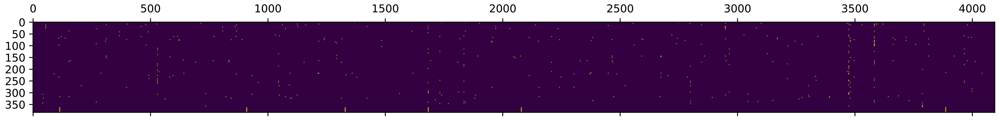

# Quantization of GLM-130B

## Usage

> Please note that SwissArmyTransformer>=0.2.11 is required for quantization

Set `CHECKPOINT_PATH` in `configs/model_glm_130b_{int4/int8}.sh` to your local checkpoint folder. The model will be first initialized from the FP16 checkpoint on the CPU memory, then dynamically quantized and transferred to the GPU memory. So please make sure you have enough CPU memory (>260GB) to store the FP16 model weights.

You need to pay attention to the tensor parallel dimension of the model checkpoint, we only provide the checkpoint in 8-way tensor parallel, i.e. 8 GPUs store a whole model. If you need to do inference on a small number of GPUs, e.g. 4 * RTX 3090 GPUs with INT4 precision, you first need to convert the checkpoint to 4-way tensor parallel using the following command and modify `MP_SIZE` in corresponding model config file.

```bash
python tools/convert_tp.py \
    --input-folder <SRC_CKPT_PATH>  \
    --output-folder <DST_CKPT_PATH> \
    --target-tp 4
```

Finally, change the model config file from `configs/model_glm_130b.sh` to `configs/model_glm_130b_{int4/int8}.sh` in your scripts (e.g. `scripts/generate.sh`), then run your scripts just as normal.
 
By default, the full precision checkpoint is expected to be loaded. Run the conversion script with `--quantization-bit-width <4 or 8>` will produce quantized model weights. To load from a quantized checkpoint, you should add `--from-quantized-checkpoint` in your model config file.

## Evaluation Results

|   | **MMLU（Accuracy↑）** | **LAMBADA（Accuracy↑  ）** | **WikiText-2（PPL↓）** | **WikiText-103（PPL↓）** | **PTB（PPL↓）** |
| ---- | -------- | ----------- | ------------------- | --------------------- | ------------ |
| FP16 | 44.751   | 80.206      | 10.901              | 10.759                | 18.964       |
| INT8 | 44.709   | 80.206      | 10.904              | 10.763                | 18.994       |
| INT4 | 44.801   | 79.468      | 11.167              | 11.046                | 19.535       |

## Space and Speed Benchmark

| **Hardware** | **GPU Memory** | **Precison** | **512**  | **1024** | **2048** |
| ------------ | -------------- | ------------ | -------- | -------- | -------- |
| 8 * A100     | 40 GB          | FP16         | 45.21 s  | 89.00 s  | 179.22 s |
| 8 * V100     | 32 GB          | INT8         | 106.35 s | 216.50 s | 449.17 s |
| 4 * RTX 3090 | 24 GB          | INT4         | 138.66 s | 292.69 s | 649.64 s |
| 8 * RTX 2080 Ti | 11 GB | INT4 | 117.39 s | 240.96 s | 528.66 s |


The above results in the table is tests with SAT. Using FasterTransformer can speed up more than 2X, as shown in the table below, and the detailed usage is shown in [Inference with FasterTransformer](../docs/inference-with-fastertransformer.md).

| **Hardware**    | **GPU Memory** | **Precison** | **128** Encode / Decode | **512** Encode / Decode | **1024** Encode / Decode | **2048** Encode / Decode |
| --------------- | -------------- | ------------ | ----------------------- | ----------------------- | ------------------------ | ------------------------ |
| 8 * A100        | 40 GB          | INT4         | 145 ms / 4.29 s         | 183 ms / 17.7 s         | 313 ms / 37.8 s          | 495 ms / 86.0 s          |
| 4 * A100        | 80 GB          | INT4         | 174 ms / 6.62 s         | 272 ms / 27.1 s         | 439 ms / 56.2 s          | 810 ms / 123 s           |
| 8 * V100        | 32 GB          | INT4         | 309 ms / 6.97 s         | 666 ms / 28.1 s         | 1208 ms / 58.4 s         | 2304 ms / 125 s          |
| 4 * V100        | 32 GB          | INT4         | 448 ms / 11.4 s         | 843 ms / 45.87 s        | 1488 ms / 93.5 s         | 2803 ms / 196 s          |
| 8 * RTX 3090    | 24 GB          | INT4         | 283 ms / 5.07 s         | 915 ms / 20.5 s         | 1793 ms / 42.7 s         | 3477 ms / 90.3 s         |
| 4 * RTX 3090    | 24 GB          | INT4         | 374 ms / 8.16 s         | 1300 ms / 32.3 s        | OOM / 66.5 s             | OOM / 150 s              |
| 8 * RTX 2080 Ti | 11 GB          | INT4         | 392 ms / 6.77 s         | 1044 ms / 27.29 s       | OOM / 56.02 s            | OOM / OOM                |

## Details

Typical methods quantize both model weights and activations to INT8, enabling the INT8 matrix multiplication kernel for efficiency. However, we found that there are outliers in GLM-130B's activations, making it hard to reduce the precision of activations. 

Concurrently, researchers from [Meta AI](https://arxiv.org/abs/2208.07339) also found the emergent outliers issue in large-scale transformers (>6.8B), which is consistent with our observations on GLM-130B. They conducted an in-depth analysis and found that the outliers make up only about 0.1% of all feature dimensions, so it's possible to make a decomposition for matrix multiplication that focuses on high precision multiplication for these particular dimensions.

|  | 
|:--:| 
| *Distribution of outliers (the white ones) in GLM-130B's activation* |

Unfortunately, the outliers in GLM-130B can sometimes make up at most 30% of the feature dimension, possibly because we used GLU as a variant of FFN. Therefore, a mixed-precision decomposition for matmul can be much less efficient than a single FP16 matmul. After a few weeks of trial, we finally decided to keep the precision of activations to FP16 and only consider the quantization of model weights. In that case, the quantized model parameters are dynamically converted to FP16 precision at runtime, introducing a small computational overhead but greatly reducing GPU memory requirements for storing model weights.

We quantized all linear layers as they take up most of the model parameters. All model weights, excluding input/output embedding, layernorm and bias terms are quantized using vector-wise symmetric quantization. At the quantization precision of INT4, two INT4 weights are compressed into one INT8 weight for saving GPU memory usage, so that only 70GB of GPU memory approximately is required for INT4 model weights.


